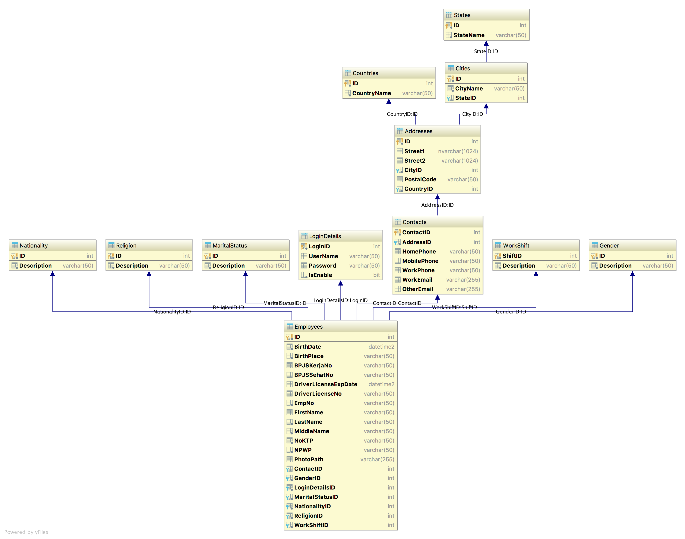

# Latihan JDBC dengan SQL Server 2017

1. Backup tabel berdasarkan tabel pada gambar di atas
2. Membuat Koneksi ke database localhost masing-masing
3. Buat inputan menggunakan `java.util.Scanner` untuk Tabel Employees
4. Buat operasi CRUD ke database berdasarkan inputan tersebut

## Cara mengerjakan soal

1. Fork repository ini
2. Clone repository yang telah di fork
3. Setelah soal selesai, push ke repository masing-masing
